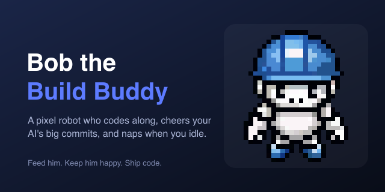

# Bob-a-gotchi

A pixel-art robot build buddy who lives in your editor sidebar (IBM Bob, VS Code, Cursor, VSCodium). Bob codes along while you type, throws his arms up and cheers when your AI ships a big block of code, lays bricks, tells dad jokes, gets hungry, and naps when you walk away. Keep him fed and he stays happy.

**Quick start** — install into your editor, no Marketplace needed:

```bash
curl -fsSL https://raw.githubusercontent.com/comacoded/bob-a-gotchi/main/install.sh | bash
```

Then reload your editor window and click the hard-hat icon in the activity bar.



## Features

- **Lives in the sidebar.** Click the hard-hat icon in the activity bar to open Bob.
- **Codes along with you.** While you type, Bob taps away at a little pixel laptop. The moment coding stops he settles back down.
- **Celebrates finished blocks.** When a burst of editing wraps up and a large block (an AI completion, a paste, a generated file) just landed, Bob throws confetti and shouts "wow great block!". Tune the line threshold in settings.
- **Needs feeding.** Bob's fullness drifts down over time, shown on a pixel-art food meter. Feed him with the burger button to top it back up.
- **Sleeps when you're away.** After a few idle minutes Bob naps and recovers energy. Wake him with a button or just start typing.
- **Persists across sessions.** Bob remembers his stats and how old he is, even after you restart VS Code.

## Care guide

The panel shows a single pixel-art food meter. Feed Bob with the burger button to keep it full. Behind the scenes he also tracks energy (recovered by sleeping) and happiness (lifted by coding and feeding), which drive his mood and when he naps.

Commands (command palette):

- `Bob: Feed Bob`
- `Bob: Wake Bob Up`
- `Bob: Reset Bob (new robot)`

## Settings

| Setting | Default | What it does |
| --- | --- | --- |
| `bob.idleSleepMinutes` | `4` | Idle minutes before Bob falls asleep. |
| `bob.aiBlockLineThreshold` | `12` | Lines in one edit that count as an AI/code-gen block and trigger a celebration. |
| `bob.statDecayMinutes` | `30` | How fast hunger and energy drift. |
| `bob.permadeath` | `false` | If on, neglecting Bob until his stats bottom out makes him leave for good. Off means he just gets sad and always recovers. |

## How it works

Bob watches document edits. Ordinary edits read as typing; a single edit that adds more than the threshold number of lines reads as a generated block and triggers his celebration. An idle timer puts him to sleep, and a slow heartbeat drains his stats and recovers his energy while he naps. All of his art is hand-generated pixel animation.

## Install (no Marketplace needed)

Bob installs straight from the packaged `.vsix`, no publishing required. Share the
`ibm-bob-tamagotchi-*.vsix` along with `install.sh`, then:

```bash
./install.sh        # finds the .vsix next to it and installs into every
                    # editor it detects (IBM Bob, VS Code, Cursor, VSCodium)
```

Or install by hand into whichever editor you use:

```bash
# IBM Bob
"/Applications/IBM Bob.app/Contents/Resources/app/bin/bobide" \
  --install-extension ibm-bob-tamagotchi-0.2.5.vsix --force
# VS Code
code --install-extension ibm-bob-tamagotchi-0.2.5.vsix --force
```

Then reload the editor window and click the hard-hat icon in the activity bar.

## Development

```bash
npm install
npm run watch     # rebuild on change
# press F5 in VS Code to launch the Extension Development Host
```

```bash
npm run package   # produce an installable .vsix via vsce
```

## Credits

Built by Nick Coma.

## License

MIT
